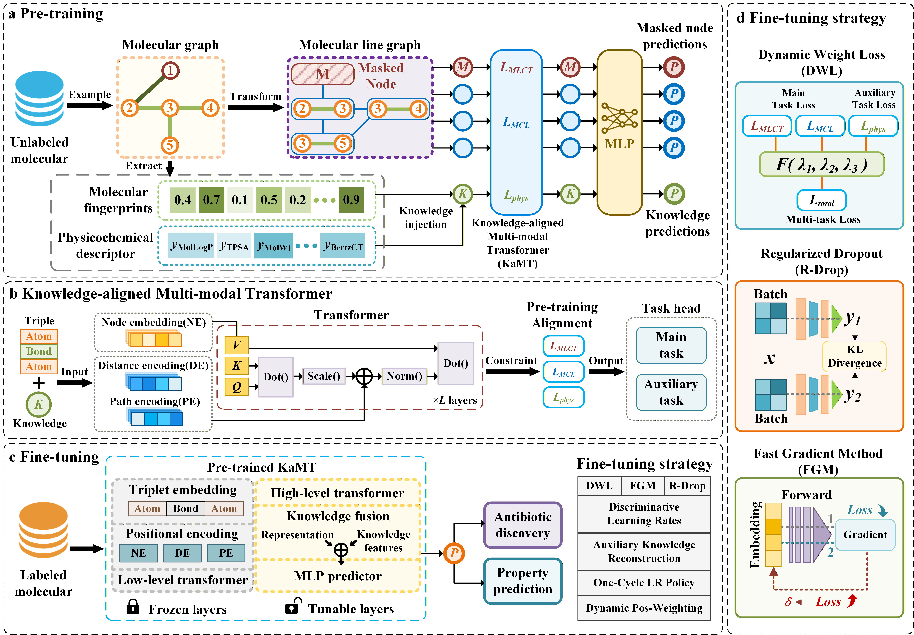

# KaMT
## About

This repository contains the code and resources of the following paper:
Knowledge-aligned Multi-modal Transformer for Enhanced Scaffold-Hopping in Antibiotic Discovery.
## Overview of the framework

KaMT is a sophisticated deep learning framework designed for molecular property prediction and antibiotic discovery. By leveraging a Knowledge-aligned Multi-modal Transformer architecture, it integrates structural graph data with explicit chemical knowledge (descriptors and fingerprints) to achieve high-fidelity molecular representations.

 

## Setup environment

Setup the required environment using the provided `environment.yml`.

    conda env create

Activate the environment

    conda activate KaMT

## Ready data

Download ChEMBL database [chembl_36.db](https://ftp.ebi.ac.uk/pub/databases/chembl/ChEMBLdb/releases/chembl_36/chembl_36_sqlite.tar.gz)(or other version).  
Then unzip the file and put it in the KaMT/dataset/chembl/ directory.  
Enter the KaMT/scripts directory  
Extract SMILES from the ChEMBL database for subsequent pre-training:  

    python extract_chembl_smiles.py --data_path ../dataset/chembl/chembl_36.db --smiles_path ../dataset/chembl/smiles.smi

## Pre-training

Enter the KaMT/scripts directory  
Prepare pre-training data: extract molecular fingerprints and knowledge descriptions of SMILES from the ChEMBL database  

    python preprocess_pretrain.py --data_path ../dataset/chembl --output_path ../dataset/chembl -extract_fp --extract_desc

Execute pre-training:  

    python pretrain_kamt.py --data_path ../dataset/chembl/ --save_path ../models/pretrained/ --n_steps 100000 --config base

## Fine-tuning

Enter the KaMT/antibiotics directory
Extract the antibiotic dataset from the ChEMBL database:  

    `python extract_antibiotics.py --db_path ../dataset/chembl/chembl_36.db --output_path ../dataset/antibiotics/raw.csv

Antibiotic dataset split  
Generate two sets of datasets according to different splitting methods:  

    python process_and_split.py --input_path ../dataset/antibiotics/raw.csv --output_dir ../dataset/antibiotics/ --split_type random  
    python process_and_split.py --input_path ../dataset/antibiotics/raw.csv --output_dir ../dataset/antibiotics/ --split_type scaffold

Extract and divide dataset molecular fingerprints and descriptor extraction:

    python extract_antibiotics_features.py --split_type random --n_jobs 32

    python extract_antibiotics_features.py --split_type scaffold --n_jobs 32

Antibiotic Classification Task Fine-tuning:

    python finetune_antibiotics.py --split scaffold --pretrained_path ../models/pretrained/final_kamt_model.pt

## Resources

